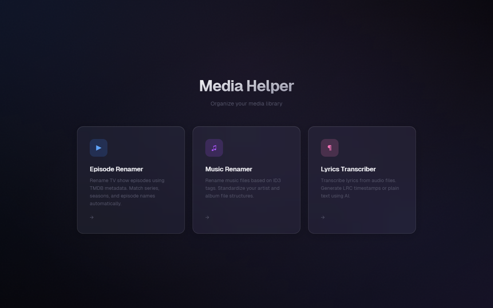
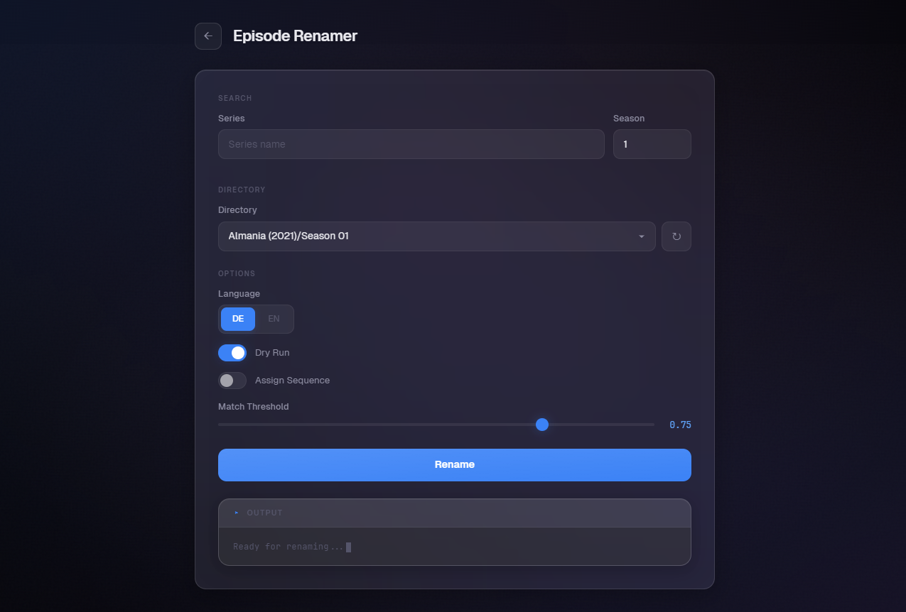
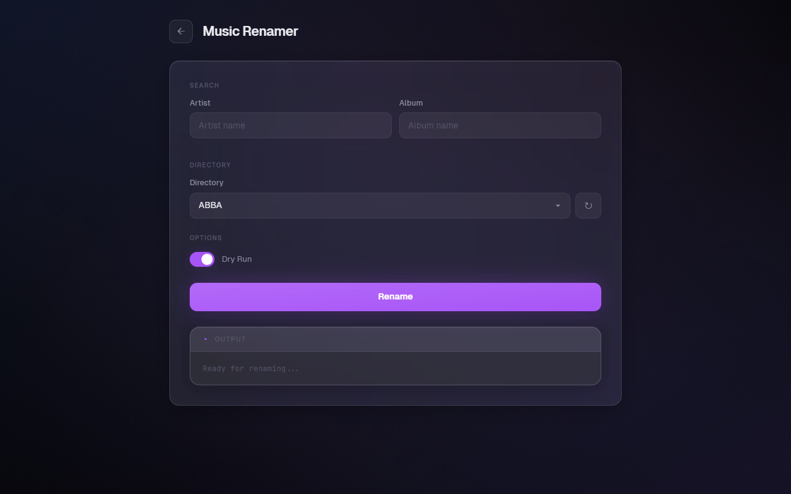
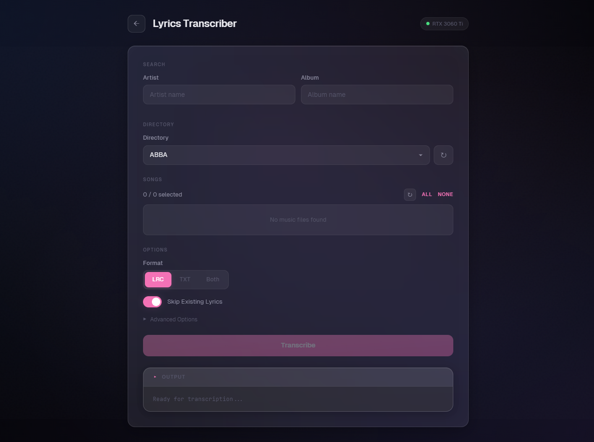

# Jellyfin Media-Renamer

[](https://www.docker.com/)
[](https://fastapi.tiangolo.com/)
[](https://react.dev/)

*A media management tool for renaming TV shows, music files, and transcribing lyrics — with a modern web interface.*

## Screenshots

| Landing Page | Episode Renamer |
|:---:|:---:|
|  |  |

| Music Renamer | Lyrics Transcriber |
|:---:|:---:|
|  |  |

## Table of Contents

- [Overview](#overview)
- [Features](#features)
- [Architecture](#architecture)
- [Prerequisites](#prerequisites)
- [Installation](#installation)
- [Configuration](#configuration)
- [API Endpoints](#api-endpoints)
- [Deployment](#deployment)
- [Development](#development)
- [Troubleshooting](#troubleshooting)

## Overview

Jellyfin Media-Renamer is a dockerized tool with three modules:

1. **Episode Renamer** — Renames TV show episodes using TMDB metadata
2. **Music Renamer** — Renames music files based on ID3/audio tags
3. **Lyrics Transcriber** — Transcribes lyrics from audio files using AI (HDemucs + Whisper + Genius)

The application consists of a FastAPI backend (Python 3.12), a React frontend (Vite + Tailwind CSS), and an optional GPU-powered lyrics transcription service. All services communicate over a Docker bridge network behind an Nginx reverse proxy.

## Features

### TV Shows
- Automatic series search via TMDB API (multi-language: DE, EN, FR, etc.)
- Episode renaming: `S01E01 - Episode title.ext`
- Intelligent filename-to-episode matching with configurable threshold
- Sequence assignment mode for unmatched files
- Batch processing of entire seasons
- Dry-run preview before renaming

### Music
- Metadata-based renaming from ID3, FLAC, Vorbis, Opus, AIFF, ASF, Musepack tags
- Supported formats: FLAC, WAV, MP3, OGG Vorbis, OGG Opus, AIFF, ASF, Musepack
- Umlaut normalization for filesystem compatibility
- Schema: `Tracknr - Artist - Title.ext`
- Artist and album directory filters

### Lyrics Transcription
- AI-powered lyrics transcription from audio files
- Three-stage pipeline: Vocal separation (HDemucs) → Speech-to-text (faster-whisper) → Lyrics correction (Genius API)
- Output formats: LRC (timestamped), TXT (plain text), or both
- Real-time progress streaming via Server-Sent Events (SSE)
- GPU health indicator showing connected GPU model
- Skip existing lyrics option
- Advanced options: language override, skip vocal separation, skip Genius correction
- Requires optional GPU service ([lyric-transcriber](https://github.com/TXCJulian/lyric-transcriber))

### General
- Modern dark-themed web interface with glassmorphism design
- Feature toggle system — enable/disable modules via environment variable
- Landing page with module navigation
- Real-time output logs per module
- Fully dockerized with Docker Compose
- Nginx reverse proxy (no CORS issues)
- Path traversal protection on all directory endpoints
- Filesystem monitoring with Watchdog

## Architecture

### Technology Stack

**Backend:**
- Python 3.12 (LTS)
- FastAPI + Uvicorn
- TMDB API (The Movie Database)
- Mutagen (audio metadata)
- Watchdog (filesystem monitoring)

**Frontend:**
- React 19 (Functional Components + Hooks)
- Vite 7 (build tool + HMR)
- Tailwind CSS 4
- TypeScript 5
- Vitest (testing)

**Infrastructure:**
- Docker + Docker Compose
- Multi-stage Docker builds
- Nginx reverse proxy
- Bridge network for service communication
- Optional: NVIDIA GPU service for lyrics transcription

### Request Flow

```
Browser                    Frontend Container               Backend Container
  |                             (Nginx)                          (FastAPI)
  |                               |                                  |
  |--[1] GET :3333/-------------->|                                  |
  |    (static assets)            |                                  |
  |                               |                                  |
  |--[2] GET :3333/directories--->|                                  |
  |                               |--[3] proxy_pass----------------->|
  |                               |    http://renamer-backend:3332   |
  |                               |<---[4] JSON response-------------|
  |<--[5] JSON response-----------|                                  |
  |                               |                                  |
  |--[6] GET :3333/transcribe/--->|                                  |
  |    (SSE stream)               |--[7] proxy_pass (no buffering)-->|
  |                               |    http://renamer-backend:3332   |
  |                               |                                  |---> lyric-transcriber:3334
  |<--[8] SSE events-------------|<---[9] SSE stream----------------|     (GPU service)
```

### Benefits

- **No CORS issues**: all requests are same-origin from the browser's perspective
- **Single entry point**: only port 3333 needs to be exposed
- **Backend stays private**: port 3332 doesn't have to be published
- **SSE support**: Nginx configured with disabled buffering for real-time streaming
- **Feature isolation**: each module can be independently enabled/disabled

## Prerequisites

- **Docker** (Version 20.10+)
- **Docker Compose** (Version 2.0+)
- **TMDB API Key** ([free at themoviedb.org](https://www.themoviedb.org/settings/api))
- **Media directory** with read/write permissions
- **Optional**: NVIDIA GPU + CUDA drivers (for lyrics transcription)

## Installation

### Step 1: Clone Repository

```bash
git clone https://github.com/TXCJulian/Jellyfin_Media-Renamer.git
cd Jellyfin_Media-Renamer
```

### Step 2: Get TMDB API Key

1. Register on [themoviedb.org](https://www.themoviedb.org/)
2. Go to Settings → API
3. Request an API Key (free)
4. Copy your API Key

### Step 3: Adjust Configuration

Edit the `docker-compose.yml` and adjust the following values:

```yaml
environment:
  - TMDB_API_KEY=YOUR_TMDB_API_KEY_HERE
  - ENABLED_FEATURES=episodes,music,lyrics  # Toggle modules
volumes:
  - /path/to/your/media:/media:rw
```

### Step 4: Start Containers

```bash
# Without lyrics transcription (CPU only)
docker compose up --build

# With lyrics transcription (requires NVIDIA GPU)
docker compose --profile gpu up --build
```

### Step 5: Open Application

- **Frontend**: http://localhost:3333
- **Backend API**: http://localhost:3332
- **API Documentation**: http://localhost:3332/docs

## Configuration

### Backend Environment Variables

| Variable | Description | Default |
|----------|-------------|---------|
| `BASE_PATH` | Base path to media in container | `/media` |
| `TVSHOW_FOLDER_NAME` | Name of TV shows folder | `TV Shows` |
| `MUSIC_FOLDER_NAME` | Name of music folder | `Music` |
| `TMDB_API_KEY` | TMDB API key (**required**) | - |
| `VALID_VIDEO_EXT` | Video file extensions (CSV) | `.mp4,.mkv,.mov,.avi` |
| `VALID_MUSIC_EXT` | Music file extensions (CSV) | `.flac,.wav,.mp3` |
| `TRANSCRIBER_URL` | Lyrics transcriber service URL | `http://lyric-transcriber:3334` |
| `ENABLED_FEATURES` | Active modules (CSV) | `episodes,music,lyrics` |
| `ALLOWED_ORIGINS` | CORS allowed origins | `http://localhost:3333` |

### Directory Structure

The application expects the following structure in your media directory:

```
/media/
├── TV Shows/
│   ├── Breaking Bad/
│   │   ├── Season 01/
│   │   │   ├── episode1.mkv
│   │   │   └── ...
│   │   └── Season 02/
│   └── ...
└── Music/
    ├── Artist Name/
    │   ├── Album Name/
    │   │   ├── 01-track.flac
    │   │   └── ...
    │   └── ...
    └── ...
```

## API Endpoints

### Configuration

| Method | Endpoint | Description |
|--------|----------|-------------|
| `GET` | `/config` | Returns enabled features |
| `GET` | `/health` | Backend health check |

### TV Shows

| Method | Endpoint | Description |
|--------|----------|-------------|
| `GET` | `/directories/tvshows` | List TV show directories (query: `series`, `season`) |
| `POST` | `/directories/refresh` | Force refresh directory cache |
| `POST` | `/rename/episodes` | Rename episodes (form: `directory`, `series`, `season`, `language`, `dry_run`, `assign_seq`, `threshold`) |

### Music

| Method | Endpoint | Description |
|--------|----------|-------------|
| `GET` | `/directories/music` | List music directories (query: `artist`, `album`) |
| `POST` | `/rename/music` | Rename music files (form: `directory`, `dry_run`) |

### Lyrics Transcription

| Method | Endpoint | Description |
|--------|----------|-------------|
| `GET` | `/transcribe/health` | Transcriber service health + GPU info |
| `GET` | `/transcribe/files` | List music files with lyrics status (query: `directory`) |
| `GET` | `/transcribe/start` | Start transcription (SSE stream, query: `directory`, `files`, `output_format`, `skip_existing`, `language`, `skip_separation`, `skip_correction`) |

## Deployment

### Local Development

```bash
# Backend (with auto-reload)
cd backend
pip install -r requirements.txt
uvicorn app.main:app --reload --host 0.0.0.0 --port 3332

# Frontend (dev server with HMR, proxies API to localhost:8000)
cd frontend
npm install
npm run dev
```

### Production with Docker Compose

```bash
# Pull images from Docker Hub
docker compose -f deploy.yml pull

# Start containers
docker compose -f deploy.yml up -d

# View logs
docker compose -f deploy.yml logs -f

# Stop containers
docker compose -f deploy.yml down
```

### Push Images to Docker Hub

```bash
# Build and tag
docker build -t bosscock/media-renamer:backend ./backend
docker build -t bosscock/media-renamer:frontend ./frontend

# Push
docker push bosscock/media-renamer:backend
docker push bosscock/media-renamer:frontend
```

For multi-arch builds (amd64 + arm64):

```bash
docker buildx create --name multi --use
docker buildx build --platform linux/amd64,linux/arm64 -t bosscock/media-renamer:backend ./backend --push
docker buildx build --platform linux/amd64,linux/arm64 -t bosscock/media-renamer:frontend ./frontend --push
```

## Development

### Project Structure

```
Jellyfin_Media-Renamer/
├── backend/
│   ├── app/
│   │   ├── main.py               # FastAPI app + all routes
│   │   ├── config.py             # Configuration + env vars
│   │   ├── rename_episodes.py    # TMDB episode matching + rename
│   │   ├── rename_music.py       # Metadata-based music rename
│   │   ├── transcribe_lyrics.py  # Lyrics transcription (SSE proxy)
│   │   ├── get_dirs.py           # Directory listing (cached)
│   │   └── fs_utils.py           # Filesystem utilities (fsync)
│   ├── tests/                    # pytest test suite
│   ├── Dockerfile
│   └── requirements.txt
├── frontend/
│   ├── src/
│   │   ├── App.tsx               # Main app + routing
│   │   ├── components/
│   │   │   ├── Landing.tsx       # Home page with module cards
│   │   │   ├── EpisodePanel.tsx  # TV show renaming panel
│   │   │   ├── MusicPanel.tsx    # Music renaming panel
│   │   │   ├── LyricsPanel.tsx   # Lyrics transcription panel
│   │   │   ├── PanelLayout.tsx   # Shared panel layout
│   │   │   ├── LogPanel.tsx      # Output log display
│   │   │   ├── ErrorBoundary.tsx
│   │   │   └── ui/              # Shared UI components
│   │   │       ├── DirectorySelect.tsx
│   │   │       ├── FormSection.tsx
│   │   │       ├── SegmentedControl.tsx
│   │   │       └── ToggleSwitch.tsx
│   │   ├── lib/
│   │   │   ├── api.ts            # API fetch utilities
│   │   │   └── sse.ts            # Server-Sent Events client
│   │   └── __tests__/            # Vitest test suite
│   ├── public/fonts/             # Self-hosted Geist + JetBrains Mono
│   ├── nginx-app.conf            # Nginx reverse proxy config
│   ├── Dockerfile
│   └── package.json
├── docker-compose.yml            # Local development
├── deploy.yml                    # Production deployment
└── README.md
```

### Code Quality

```bash
# Backend: formatting + linting
pip install black ruff
black backend/app/
ruff check backend/app/

# Frontend: formatting
cd frontend && npm run format
```

### Testing

```bash
# Backend tests
cd backend
pip install pytest
pytest

# Frontend tests
cd frontend
npm run test
```

## Troubleshooting

### Backend cannot start

```bash
# View logs
docker compose logs renamer-backend

# Common causes:
# 1. Missing TMDB_API_KEY
# 2. Invalid media path in volume
# 3. Missing permissions for /media
```

### Frontend cannot reach backend (502 Bad Gateway)

1. Check that both containers are in the same network:
```bash
docker network inspect renamer-network
```

2. Check service names in `nginx-app.conf`:
```nginx
proxy_pass http://renamer-backend:3332;  # Must match docker-compose.yml
```

### Lyrics transcriber shows "Offline"

1. Ensure the GPU service is running: `docker compose --profile gpu ps`
2. Check the transcriber health: `curl http://localhost:3334/health`
3. Verify `TRANSCRIBER_URL` is set correctly in the backend environment
4. The transcriber requires an NVIDIA GPU with CUDA drivers

### Renamed files not visible on SMB/CIFS or NFS shares

The renamer calls `fsync()` on the parent directory after each rename to flush metadata changes. For persistent issues:

```bash
# SMB/CIFS: reduce cache timeout
mount -t cifs //server/share /mnt -o username=user,actimeo=0

# NFS: reduce attribute cache
mount -t nfs server:/export /mnt -o actimeo=1,vers=4
```

### Umlauts displayed incorrectly

- Music: Check if audio tags are UTF-8 encoded
- TV Shows: Check TMDB language setting
- The code normalizes umlauts automatically (ä→ae, ö→oe, ü→ue)

---

**Made for Jellyfin and Plex users**
