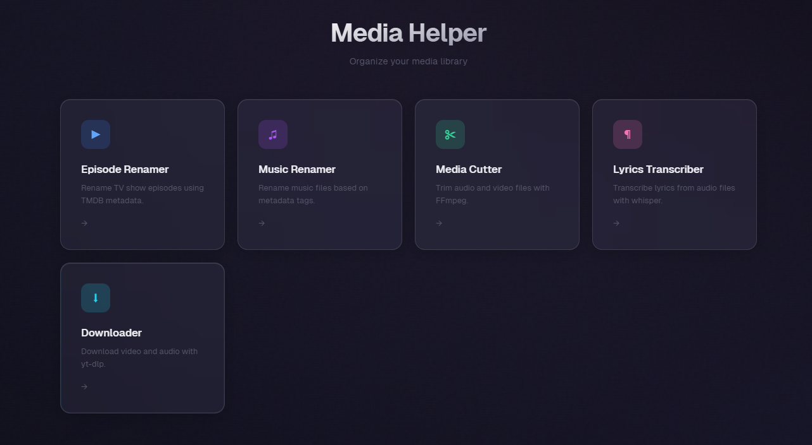
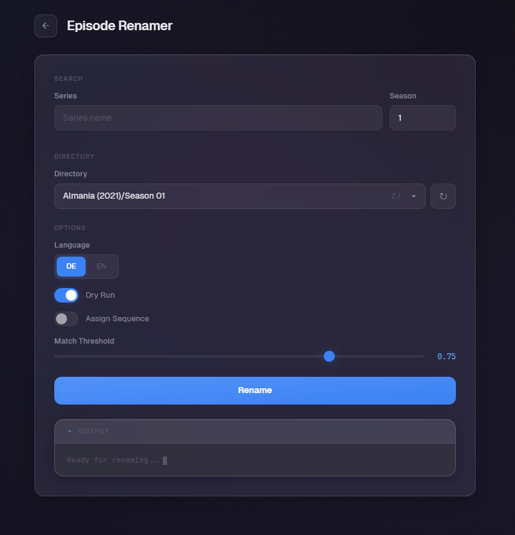
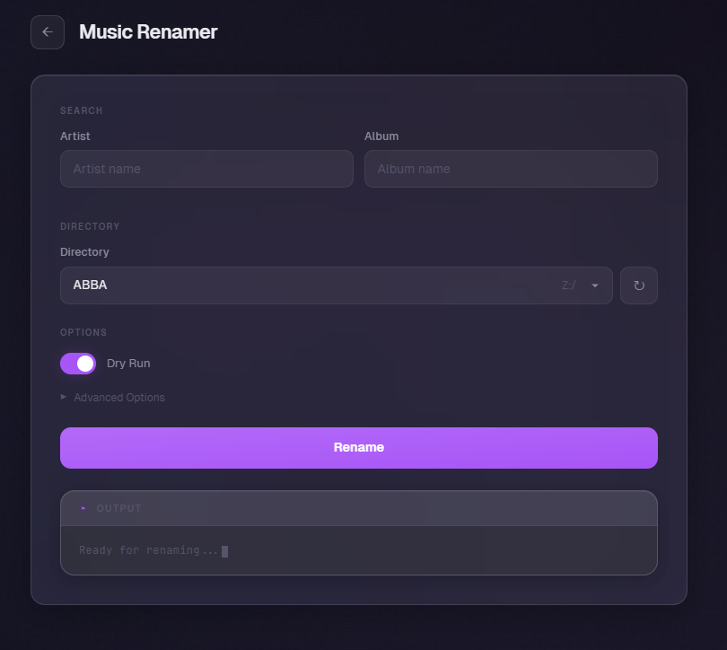
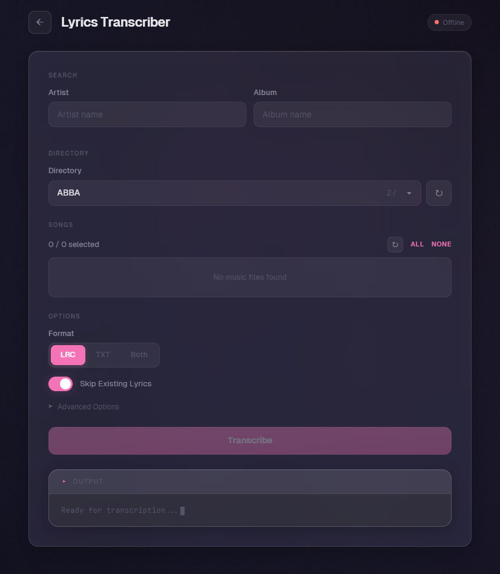
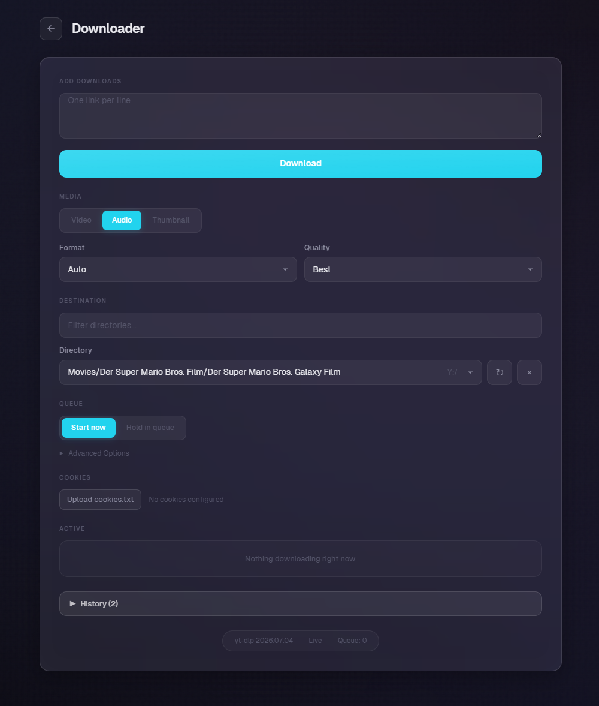
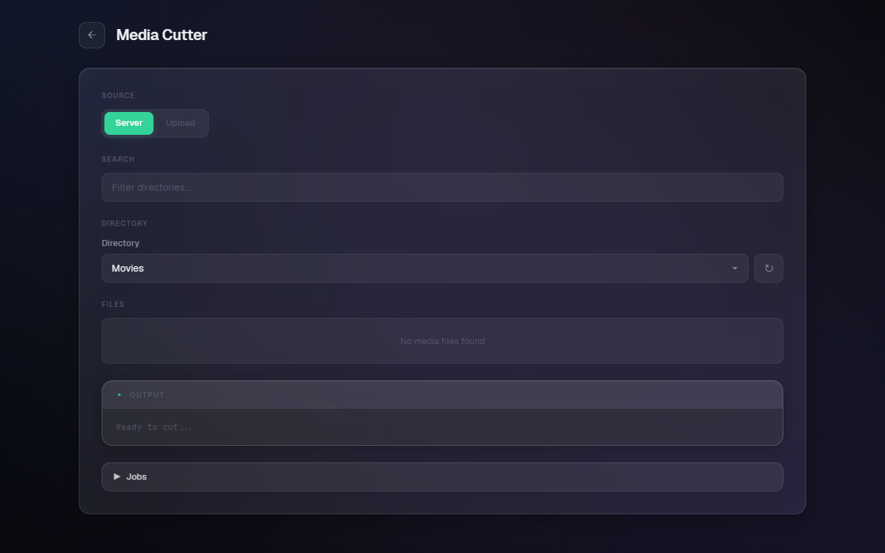
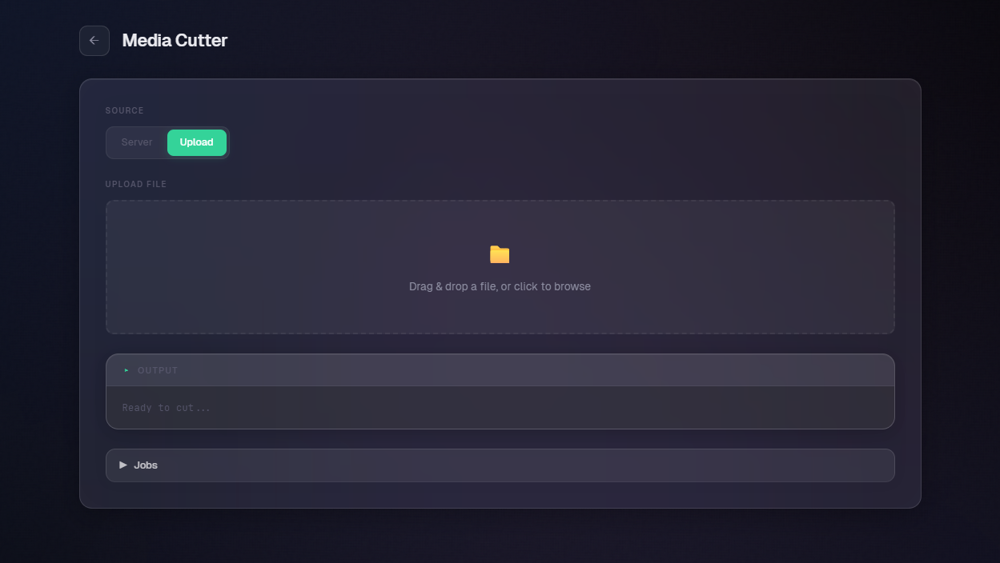

# Media-Helper

[](https://www.docker.com/)
[](https://fastapi.tiangolo.com/)
[](https://react.dev/)
[](https://github.com/jellyfin/jellyfin-ffmpeg)
[](https://www.ffmpeg.org/)

A media management tool for renaming TV shows, music files, transcribing lyrics, and cutting media.

## Screenshots

| Landing Page |
| --- |
|  |

| Episode Renamer | Music Renamer |
| --- | --- |
|  |  |

| Lyric Transcriber | Downloader |
| --- | --- |
|  |  |

| Media Cutter (Server) | Media Cutter (Upload) |
| --- | --- |
|  |  |

## Table of Contents

- [Overview](#overview)
- [Related Projects](#related-projects)
- [Features](#features)
- [Architecture](#architecture)
- [Prerequisites](#prerequisites)
- [Installation](#installation)
- [Configuration](#configuration)
- [API Endpoints](#api-endpoints)
- [Deployment](#deployment)
- [Development](#development)
- [Troubleshooting](#troubleshooting)

## Overview

Media-Helper is a dockerized tool with five modules:

1. **Episode Renamer** - Renames TV show episodes using TMDB metadata
2. **Music Renamer** - Renames music files based on ID3/audio tags
3. **Lyric Transcriber** - Transcribes lyrics from audio files using AI (HDemucs + Whisper + Genius)
4. **Media Cutter** - Trim and cut audio/video files with waveform preview and per-track codec control
5. **Downloader** - Download media via yt-dlp with codec/format/quality selection, playlist support, and cookie authentication

The application consists of a FastAPI backend (Python 3.14), a React frontend (Vite + Tailwind CSS), and an optional GPU-powered lyrics transcription service. All services communicate over a Docker bridge network behind an Nginx reverse proxy.

## Related Projects

This repo deliberately keeps some functionality out of its own backend and delegates it to standalone companion services instead. The dividing line isn't "feature vs. feature" — it's whether the work needs a heavy, optional, often GPU-bound dependency (large image, non-trivial build, real GPU driver requirements) that most deployments of this app shouldn't have to pay for. Splitting that work out means:

- Deployments that only need renaming/cutting/downloading never build or pull a GPU-capable image they don't use.
- The heavy service can run on whichever machine actually has the right hardware, independent of where this backend is deployed (e.g. a small low-power node), and gets pointed at via a `*_URL` environment variable.
- Each service has its own build, release cadence, and Docker image, decoupled from this repo's.

| Service | Purpose | Required for |
| --- | --- | --- |
| [Whisper_Lyric-Transcriber](https://github.com/TXCJulian/Whisper_Lyric-Transcriber) | Vocal separation (Demucs) → speech-to-text (faster-whisper) → Genius lyrics correction | The **Lyrics Transcription** module (`TRANSCRIBER_URL`) |

More companion services following this pattern may be added as GPU-heavy features (e.g. automated encoding) are introduced.

## Features

### TV Shows

- Automatic series search via TMDB API (multi-language: DE, EN, etc.)
- Episode renaming: `SxxExx Episode title.ext` (`S` = season number, `E` = episode number)
- Intelligent filename-to-episode matching with configurable threshold
- Sequence assignment mode for unmatched files
- Batch processing of entire seasons
- Dry-run preview before renaming

### Music

- Metadata-based renaming from ID3, FLAC, Vorbis, Opus, AIFF, ASF, Musepack tags
- Supported formats: FLAC, WAV, MP3, OGG Vorbis, OGG Opus, AIFF, ASF, Musepack
- Umlaut normalization for filesystem compatibility
- Schema: `DxxTxx Title.ext` (`D` = disc number, `T` = track number)
- Artist and album directory filters
- Choose whether sidecar `.lrc`/`.txt` lyrics are renamed alongside the song or deleted

### Lyrics Transcription

- AI-powered lyrics transcription from audio files
- Three-stage pipeline: Vocal separation (HDemucs) → Speech-to-text (faster-whisper) → Lyrics correction (Genius API)
- Output formats: LRC (timestamped), TXT (plain text), or both
- Real-time progress streaming via Server-Sent Events (SSE)
- GPU health indicator showing connected GPU model
- Skip existing lyrics option
- Advanced options: Whisper model size, language override, skip vocal separation, skip Genius correction
- Genius artist/title override when a single song is selected (for wrong or missing tags)
- **Requires optional GPU service ([Whisper_Lyric-Transcriber](https://github.com/TXCJulian/Whisper_Lyric-Transcriber))**

### Media Cutter

- Trim audio and video files with precise in/out point selection
- Waveform visualization and video thumbnail strip for navigation
- Per-track audio codec selection (AAC, FLAC, Opus, AC3, MP3, Vorbis, PCM)
- Video re-encoding support (H.264, H.265, VP9, AV1) with keep-quality option
- Stream copy mode for lossless, instant cuts
- Server file browser or direct file upload (up to 50 GB)
- Automatic browser preview transcoding for non-compatible formats
- Three preview modes for problematic files: original playback, transcode audio only, and full transcode
- Non-blocking preview generation workflow (status polling + retry)
- Per-track preview caching for audio-only transcode artifacts
- Job-based workflow with persistent state and output downloads
- Save output files back to the source directory
- Real-time cut progress streaming via SSE
- Automatic GPU encoder usage for preview/cut re-encoding when supported (with safe CPU fallback)
- Supported formats: MP4, MKV, MOV, AVI, WebM, MP3, FLAC, M4A, WAV, AAC, AC3, DTS, Opus, OGG, AIFF

### Downloader

- Downloads video, audio, or thumbnails from any [yt-dlp](https://github.com/yt-dlp/yt-dlp)-supported site via URL
- Paste multiple links at once (one per line) — each becomes its own queued job
- Media type selector: Video (MP4/MKV/WebM/MOV), Audio (MP3/M4A/FLAC/Opus/WAV), or Thumbnail (JPG/PNG/WebP)
- Quality selection: video up to 2160p or "worst"; audio up to 320kbps or "worst"
- Optional re-encode to a specific codec (H.264/H.265/VP9/AV1 for video, MP3/FLAC/AAC/Opus for audio) — runs as a separate, cancellable stage after the download completes; left on "auto" the original codec is kept and no re-encode runs
- Destination picker: save to the configured `DOWNLOADS_DIR`, or into any directory under `BASE_PATHS` with an optional subfolder
- Advanced options: playlist item limit, filename prefix/override
- "Start now" or "hold in queue" per submission — held jobs can be started later from the job card
- Playlist URLs report progress per item, not just per job
- Cookie authentication: upload a `cookies.txt` for sites that require a logged-in session (e.g. age-restricted or private content)
- Live job cards via SSE with per-item progress, cancel, retry, and delete actions; a collapsible history section keeps finished/failed/cancelled jobs
- Queued and in-progress jobs are persisted to SQLite and resume automatically after a backend restart
- Concurrent download workers (`DOWNLOADER_WORKERS`, default 3) — additional jobs wait in the queue rather than being rejected

### General

- Modern dark-themed web interface with glassmorphism design
- Feature toggle system - enable/disable modules via environment variable
- Landing page with module navigation
- Real-time output logs per module
- Fully dockerized with Docker Compose
- Nginx reverse proxy (no CORS issues)
- Path traversal protection on all directory endpoints
- Filesystem monitoring with Watchdog

## Architecture

### Technology Stack

**Backend:**

- Python 3.14
- FastAPI + Uvicorn
- TMDB API (The Movie Database)
- Mutagen (audio metadata)
- ffmpeg (media cutting/transcoding)
- Auto-detected FFmpeg hardware acceleration for cutter encoding (NVENC/QSV/AMF/VAAPI)
- Watchdog (filesystem monitoring)

**Frontend:**

- React 19 (Functional Components + Hooks)
- Vite 8 (build tool + HMR)
- Tailwind CSS 4
- TypeScript 7
- Vitest (testing)

**Infrastructure:**

- Docker + Docker Compose
- Multi-stage Docker builds
- Nginx reverse proxy
- Bridge network for service communication
- Optional: NVIDIA or Intel Arc GPU service for lyrics transcription (AMD ROCm builds too but is untested; CPU fallback also available)
- Cutter backend container uses Jellyfin FFmpeg build on amd64 for broader HW encoder availability

### Request Flow

```text
Browser                    Frontend Container               Backend Container
  |                             (Nginx)                          (FastAPI)
  |                               |                                  |
  |--[1] GET :3333/-------------->|                                  |
  |    (static assets)            |                                  |
  |                               |                                  |
  |--[2] GET :3333/directories--->|                                  |
  |                               |--[3] proxy_pass----------------->|
  |                               |    http://helper-backend:3332    |
  |                               |<---[4] JSON response-------------|
  |<--[5] JSON response-----------|                                  |
  |                               |                                  |
  |--[6] GET :3333/transcribe/--->|                                  |
  |    (SSE stream)               |--[7] proxy_pass (no buffering)-->|
  |                               |    http://helper-backend:3332    |
  |                               |                                  |---> lyric-transcriber:3334
  |<--[8] SSE events--------------|<---[9] SSE stream----------------|     (GPU service)
```

### Benefits

- **No CORS issues**: all requests are same-origin from the browser's perspective
- **Single entry point**: only port 3333 needs to be exposed
- **Backend stays private**: port 3332 is not published - the backend is only reachable via Nginx
- **SSE support**: Nginx configured with disabled buffering for real-time streaming
- **Feature isolation**: each module can be independently enabled/disabled
- **Session-based auth**: when `AUTH_USERNAME`/`AUTH_PASSWORD` are set, all endpoints require a valid signed session
- **HMAC-signed file IDs**: cutter file identifiers are HMAC-signed to prevent forgery or path traversal via crafted IDs

## Prerequisites

- **Docker** (Version 20.10+)
- **Docker Compose** (Version 2.0+)
- **TMDB API Key** ([free at themoviedb.org](https://www.themoviedb.org/settings/api))
- **Media directory** with read/write permissions
- **Node** 22.22.2+, 24.15+, or 26+ (only for local frontend development; the Docker build is unaffected)
- **Optional**: Hardware-acceleration compatible APU/GPU (for ffmpeg in cutter section)
- **Optional**: NVIDIA GPU + CUDA drivers, or Intel Arc GPU + oneAPI/Level Zero drivers (for lyrics transcription; see [Whisper_Lyric-Transcriber](https://github.com/TXCJulian/Whisper_Lyric-Transcriber)'s README for per-GPU requirements)

## Installation

### Step 1: Clone Repository

```bash
git clone https://github.com/TXCJulian/Media-Helper.git
cd Media-Helper
```

### Step 2: Get TMDB API Key

1. Register on [themoviedb.org](https://www.themoviedb.org/)
2. Go to Settings → API
3. Request an API Key (free for personal usage)
4. Copy your API Key

### Step 3: Adjust Configuration

Edit the `docker-compose.yml` and adjust the following values:

```yaml
environment:
  - TMDB_API_KEY=YOUR_TMDB_API_KEY_HERE
  - ENABLED_FEATURES=episodes,music,lyrics,cutter,download,encoder  # Enable modules
volumes:
  - /path/to/your/media:/media:rw
```

### Step 4: Start Containers

```bash
# Without lyrics transcription (CPU only)
docker compose up --build

# With lyrics transcription (requires an NVIDIA or Intel Arc GPU)
docker compose --profile gpu up --build #Clone transcriber repo first
```

### Step 5: Open Application

- **Frontend**: <http://localhost:3333>
- **Backend API**: <http://localhost:3332>
- **API Documentation**: <http://localhost:3332/docs>

## Configuration

### Backend Environment Variables

| Variable | Description | Default |
| -------- | ----------- | ------- |
| `BASE_PATH` | **Deprecated** - use `BASE_PATHS` instead | |
| `BASE_PATHS` | Base path(s) to media in container (CSV) | `/media` |
| `TVSHOW_FOLDER_NAME` | Name of TV shows folder | `TV Shows` |
| `MUSIC_FOLDER_NAME` | Name of music folder | `Music` |
| `TMDB_API_KEY` | TMDB API key (**required**) | - |
| `VALID_VIDEO_EXT` | Video file extensions (CSV) | `.mp4,.mkv,.mov,.avi` |
| `VALID_MUSIC_EXT` | Music file extensions (CSV) | `.flac,.wav,.mp3` |
| `TRANSCRIBER_URL` | Lyric transcriber service URL | `http://lyric-transcriber:3334` |
| `ENABLED_FEATURES` | Active modules (CSV): `episodes,music,lyrics,cutter,download,encoder` | `episodes,music,cutter,download` (+ `lyrics` when `TRANSCRIBER_URL` is set) |
| `ALLOWED_ORIGINS` | CORS allowed origins | `http://localhost:3333` |
| `VALID_CUTTER_EXT` | Cutter file extensions (CSV) | `.mp4,.mkv,.mov,.avi,.webm,.mp3,.flac,.m4a,.wav,.aac,.ac3,.dts,.opus,.ogg,.aiff` |
| `CUTTER_JOBS_DIR` | Directory for cutter job data | `/data/cutter-jobs` |
| `CUTTER_JOB_TTL` | Job expiry in seconds | `86400` |
| `CUTTER_MAX_DIRECT_REMUX_BYTES` | Max file size for direct remux preview | `1073741824` (1 GB) |
| `DOWNLOADS_DIR` | Fallback download output root (used when no base/output directory is chosen) | `/downloads` |
| `DOWNLOADER_DATA_DIR` | Directory for the downloader's SQLite job store, cookie file and scratch space | `/data/downloader` |
| `DOWNLOADER_DB` | Path to the SQLite job store | `$DOWNLOADER_DATA_DIR/downloader.db` |
| `DOWNLOADER_WORKERS` | Number of concurrent download workers | `3` |
| `DOWNLOADER_JOB_TTL` | Download job history retention in seconds | `604800` (7 days) |
| `YT_DLP_COOKIES` | Path to cookies.txt for yt-dlp (optional) | `$DOWNLOADER_DATA_DIR/cookies.txt` |
| `ENCODER_URL` | URL of the remote `HandBrake_Video-Encoder` service (**required** for the `encoder` feature) | `http://video-encoder:3335` |
| `ENCODER_WATCH_PATHS` | Folders to watch for new video files (CSV, in-container paths) | *(empty — watcher stays off)* |
| `ENCODER_MODE` | `review` (queue for approval) or `auto` (encode unattended) | `review` |
| `ENCODER_ORIGINAL_TTL` | Seconds to retain the original after a successful encode before purging it (`0` deletes immediately) | `604800` (7 days) |
| `ENCODER_SETTLE_SECONDS` | Seconds a watched file's size must be stable before it is probed | `30` |
| `ENCODER_JOB_TTL` | Encode job history retention in seconds | `604800` (7 days) |
| `ENCODER_DATA_DIR` | Directory for the encoder's SQLite job store and retained-originals holding area | `/data/encoder` |
| `ENCODER_DB` | Path to the SQLite job store | `$ENCODER_DATA_DIR/encoder.db` |
| `HWACCEL` | Cutter hardware acceleration mode (`off` disables; otherwise auto-detect) | auto-detect |
| `VAAPI_DEVICE` | VAAPI render node path (used for VAAPI backend) | `/dev/dri/renderD128` |
| `AUTH_USERNAME` | Login username (optional - auth disabled if unset) | - |
| `AUTH_PASSWORD` | Login password (optional - auth disabled if unset) | - |
| `SECRET_KEY` | Session signing key (optional - auto-generated and persisted if unset) | auto-generated |
| `PUID` | User ID the container process runs as | `1000` |
| `PGID` | Group ID the container process runs as | `1000` |

The `encoder` feature requires the separate `HandBrake_Video-Encoder` service to be deployed and reachable at `ENCODER_URL`. Both this renamer and the encoder service must mount the media library at identical in-container paths, since the renamer sends the encoder in-container source paths and never transfers file contents itself.

`ENCODER_WATCH_PATHS` seeds the watch-folder list only on the encoder's first run. After that first seed, changes saved from **Auto Encoder → Watch Folders** are persisted in the encoder SQLite database and restored across restarts; later environment-variable changes do not overwrite them. Saving an empty list intentionally pauses the watcher. Every watch folder must already exist within one of the configured `BASE_PATHS`. Mount `ENCODER_DATA_DIR` (default `/data/encoder`) as a persistent volume if the saved configuration and job history must also survive container replacement.

The preset editor always loads the complete stored HandBrake preset leaf. Guided edits update the name, encoder, speed, format, and quality fields while preserving advanced JSON keys that are not shown in the guided form. When no preset exists yet, choose **New raw preset**, enter a complete HandBrake preset leaf with at least `PresetName`, `VideoEncoder`, `VideoPreset`, and `FileFormat`, and save it. That saved leaf can then seed guided preset creation.

### Frontend Environment Variables

The frontend's Nginx config proxies API calls to the backend. The target host/port is templated into `nginx-app.conf` at container startup via `docker-entrypoint.sh` — override these if the backend service is reachable under a different name (e.g. a Kubernetes Service name instead of the Docker Compose service name):

| Variable | Description | Default |
| -------- | ----------- | ------- |
| `BACKEND_HOST` | Hostname of the backend service | `helper-backend` |
| `BACKEND_PORT` | Port of the backend service | `3332` |

### Authentication

Authentication is opt-in for backward compatibility. If `AUTH_USERNAME` and `AUTH_PASSWORD` are not set, the application runs without any login requirement.

When both are set, all endpoints are protected by a session-based login. The session is signed with `SECRET_KEY`; if that variable is unset a key is auto-generated and written to `/var/lib/media-renamer/.secret_key` inside the container so sessions survive container restarts.

**Enabling auth in `docker-compose.yml`:**

```yaml
environment:
  - AUTH_USERNAME=admin
  - AUTH_PASSWORD=changeme
  # SECRET_KEY is optional - omit to auto-generate, or set for reproducibility:
  # - SECRET_KEY=your-random-secret-here
```

### Directory Structure

The application expects the following structure in your media directory:

```text
/media/
├── TV Shows/
│   ├── Breaking Bad/
│   │   ├── Season 01/
│   │   │   ├── episode1.mkv
│   │   │   └── ...
│   │   └── Season 02/
│   └── ...
├── Music/
│   ├── Artist Name/
│   │   ├── Album Name/
│   │   │   ├── 01-track.flac
│   │   │   └── ...
│   │   └── ...
│   └── ...
└── Movies/                  ← Media Cutter browses all of /media/
    │   ├── Movie Name/
    │   │   ├── movie1.flac
    │   │   └── ...
    │   ├── Movie Collection/
    │   │   ├── Movie Name/
    │   │   │   └── movie1.flac
    │   │   │   
    │   │   ├── Movie Name/
    │   │   │   └── movie2.flac
    │   │   └── ...
    └── ...
```

> **Note:** The Episode Renamer and Music Renamer only scan their respective subdirectories (`TV Shows/`, `Music/`). The Media Cutter scans the entire `BASE_PATHS` so it can access files in any subdirectory (Movies, TV Shows, Music, etc.).

## API Endpoints

### Configuration Endpoints

| Method | Endpoint | Description |
| ------ | -------- | ----------- |
| `GET` | `/config` | Returns enabled features |
| `GET` | `/health` | Backend health check |

### TV Shows Endpoints

| Method | Endpoint | Description |
| ------ | -------- | ----------- |
| `GET` | `/directories/tvshows` | List TV show directories (query: `series`, `season`) |
| `POST` | `/directories/refresh` | Force refresh directory cache |
| `POST` | `/rename/episodes` | Rename episodes (form: `directory`, `series`, `season`, `language`, `dry_run`, `assign_seq`, `threshold`) |

### Music Endpoints

| Method | Endpoint | Description |
| ------ | -------- | ----------- |
| `GET` | `/directories/music` | List music directories (query: `artist`, `album`) |
| `POST` | `/rename/music` | Rename music files (form: `directory`, `base`, `dry_run`, `lyrics_action`) |

### Lyrics Transcription Endpoints

| Method | Endpoint | Description |
| ------ | -------- | ----------- |
| `GET` | `/transcribe/health` | Transcriber service health + GPU info |
| `GET` | `/transcribe/files` | List music files with lyrics status (query: `directory`) |
| `POST` | `/transcribe/start` | Start transcription (SSE stream, form: `directory`, `base`, `files` (JSON array of filenames), `output_format`, `skip_existing`, `language`, `no_separation`, `no_correction`, `demucs_model`, `whisper_model`, `artist_override`, `title_override`) |

### Media Cutter Endpoints

| Method | Endpoint | Description |
| ------ | -------- | ----------- |
| `GET` | `/cutter/files` | List media files in a directory (query: `directory`) |
| `GET` | `/cutter/probe` | Probe file metadata with ffprobe (query: `path`, `source`, `job_id`) |
| `GET` | `/cutter/waveform` | Generate audio waveform data (query: `path`, `source`, `job_id`, `peaks`) |
| `GET` | `/cutter/thumbnails` | Generate video thumbnail strip (query: `path`, `source`, `job_id`, `count`) |
| `GET` | `/cutter/stream/{file_id}` | Stream/preview media (query: `audio_stream`, `transcode`, `audio_only`, `transcode_audio_only`) |
| `GET` | `/cutter/preview-status/{file_id}` | Check preview transcode progress (query: `audio_transcode_stream`) |
| `POST` | `/cutter/upload` | Upload a file to a cutter job |
| `POST` | `/cutter/jobs` | Create a new cutter job |
| `GET` | `/cutter/jobs` | List all cutter jobs |
| `GET` | `/cutter/jobs/{job_id}` | Get job metadata |
| `DELETE` | `/cutter/jobs/{job_id}` | Delete a job and its files |
| `GET` | `/cutter/jobs/{job_id}/download/{filename}` | Download an output file |
| `POST` | `/cutter/jobs/{job_id}/save/{filename}` | Save output back to source directory |
| `POST` | `/cutter/cut` | Cut a media file (SSE stream, form: `path`, `source`, `job_id`, `in_point`, `out_point`, `codec`, `audio_codec`, `container`, `stream_copy`, `keep_quality`, `audio_tracks`) |

### Downloader Endpoints

| Method | Endpoint | Description |
| ------ | -------- | ----------- |
| `GET` | `/download/status` | yt-dlp version, cookie presence, downloads dir, queue depth, worker count |
| `POST` | `/download` | Create jobs (JSON body: `urls: string[]`, `options: object`) → `{job_ids: string[]}`. One request per bulk submission - all URLs become jobs, none is rejected for exceeding the worker cap |
| `GET` | `/download/jobs` | List all jobs |
| `GET` | `/download/jobs/{job_id}` | Get job status/progress, including per-item detail |
| `POST` | `/download/jobs/{job_id}/start` | Start a queued job that wasn't auto-started |
| `POST` | `/download/jobs/{job_id}/cancel` | Cancel an active job (download or re-encode stage) |
| `DELETE` | `/download/jobs/{job_id}` | Cancel (if active) and delete a job |
| `GET` | `/download/jobs/{job_id}/items/{index}/file` | Download a completed item's output file |
| `GET` | `/download/events` | SSE stream: a full snapshot on connect, then incremental job updates |
| `POST` | `/download/cookies` | Upload a `cookies.txt` for yt-dlp (max 1 MB) |
| `DELETE` | `/download/cookies` | Remove the stored cookie file |

Jobs beyond `DOWNLOADER_WORKERS` wait in the queue rather than being rejected. A job holds one or more output items, so playlist URLs report progress per item. When a codec is explicitly selected, re-encoding runs as a separate, cancellable stage after the download completes. Queued and in-progress jobs are persisted to SQLite and resume automatically after a backend restart.

## Deployment

### Local Development

```bash
# Backend (with auto-reload)
cd backend
pip install -r requirements.txt
uvicorn app.main:app --reload --port 8000

# Frontend (dev server with HMR, proxies API to localhost:8000)
cd frontend
npm ci
npm run dev    # Runs on http://localhost:5173
```

### Production with Docker Compose

```bash
# Pull images from Docker Hub
docker compose -f deploy.yml pull

# Start containers
docker compose -f deploy.yml up -d

# View logs
docker compose -f deploy.yml logs -f

# Stop containers
docker compose -f deploy.yml down
```

### Prebuilt Images

CI/CD (`.github/workflows/ci-cd.yaml`) builds and publishes multi-arch (amd64 + arm64) images on every push to `master`, to both Docker Hub and GitHub Container Registry. Pushes to other branches publish `_beta`-tagged images instead.

| Image | Docker Hub | GitHub Container Registry |
| ----- | ---------- | -------------------------- |
| Backend | `txcjulian/media-helper:backend` | `ghcr.io/txcjulian/media-helper:backend` |
| Frontend | `txcjulian/media-helper:frontend` | `ghcr.io/txcjulian/media-helper:frontend` |

```bash
# Pull from GHCR instead of Docker Hub
docker pull ghcr.io/txcjulian/media-helper:backend
docker pull ghcr.io/txcjulian/media-helper:frontend
```

### Push Images Manually

```bash
# Build and tag
docker build -t txcjulian/media-helper:backend ./backend
docker build -t txcjulian/media-helper:frontend ./frontend

# Push to Docker Hub
docker push txcjulian/media-helper:backend
docker push txcjulian/media-helper:frontend
```

For multi-arch builds (amd64 + arm64), pushed to both registries in one go:

```bash
docker buildx create --use
docker buildx build --platform linux/amd64,linux/arm64 \
  -t txcjulian/media-helper:backend -t ghcr.io/txcjulian/media-helper:backend \
  ./backend --push
docker buildx build --platform linux/amd64,linux/arm64 \
  -t txcjulian/media-helper:frontend -t ghcr.io/txcjulian/media-helper:frontend \
  ./frontend --push
```

## Development

### Project Structure

```text
Media-Helper/
├── backend/
│   ├── app/
│   │   ├── main.py                     # FastAPI app + all routes
│   │   ├── config.py                   # Configuration + env vars
│   │   ├── rename_episodes.py          # TMDB episode matching + rename
│   │   ├── rename_music.py             # Metadata-based music rename
│   │   ├── transcribe_lyrics.py        # Lyrics transcription (SSE proxy)
│   │   ├── cutter.py                   # Media cutting (ffmpeg, jobs, preview)
│   │   ├── hwaccel.py                  # GPU encoder detection + ffmpeg arg mapping
│   │   ├── get_dirs.py                 # Directory listing (cached)
│   │   ├── fs_utils.py                 # Filesystem utilities (fsync)
│   │   ├── downloader/                 # Queue-backed yt-dlp downloads
│   │   │   ├── routes.py               # FastAPI routes
│   │   │   ├── store.py                # SQLite-backed job store
│   │   │   ├── queue.py                # Worker pool + startup recovery
│   │   │   ├── runner.py               # Per-job download/transcode orchestration
│   │   │   ├── ydl.py                  # yt-dlp option building
│   │   │   ├── transcode.py            # Cancellable ffmpeg re-encode stage
│   │   │   └── events.py               # SSE event broadcaster
│   │   └── encoder/                    # Watcher + remote HandBrake orchestration
│   │       ├── routes.py               # Runtime config, presets, rules, and jobs API
│   │       ├── runtime.py              # Persisted Watchdog lifecycle
│   │       ├── store.py                # SQLite settings, presets, and job store
│   │       ├── queue.py                # Encode queue + startup recovery
│   │       └── events.py               # SSE job event broadcaster
│   ├── tests/                          # pytest test suite (incl. hwaccel + audio-only transcode)
│   ├── Dockerfile
│   └── requirements.txt
├── frontend/
│   ├── src/
│   │   ├── App.tsx                     # Main app + routing
│   │   ├── components/
│   │   │   ├── Landing.tsx             # Home page with module cards
│   │   │   ├── EpisodePanel.tsx        # TV show renaming panel
│   │   │   ├── MusicPanel.tsx          # Music renaming panel
│   │   │   ├── LyricsPanel.tsx         # Lyrics transcription panel
│   │   │   ├── CutterPanel.tsx         # Media cutting panel
│   │   │   ├── DownloaderPanel.tsx     # Downloader panel
│   │   │   ├── EncoderPanel.tsx        # Auto Encoder operator panel
│   │   │   ├── downloader/             # Downloader sub-components
│   │   │   │   ├── DownloadOptions.tsx
│   │   │   │   └── DownloadJobCard.tsx
│   │   │   ├── cutter/                 # Cutter sub-components
│   │   │   │   ├── MediaPlayer.tsx
│   │   │   │   ├── TrimControls.tsx
│   │   │   │   ├── WaveformBar.tsx
│   │   │   │   ├── ThumbnailStrip.tsx
│   │   │   │   ├── OutputSettings.tsx
│   │   │   │   ├── AudioTrackSelect.tsx
│   │   │   │   ├── TrackModeSelect.tsx
│   │   │   │   └── JobManager.tsx
│   │   │   ├── encoder/                # Encoder settings, presets, and job cards
│   │   │   │   ├── EncoderSettings.tsx
│   │   │   │   ├── PresetEditor.tsx
│   │   │   │   └── EncoderJobCard.tsx
│   │   │   ├── PanelLayout.tsx         # Shared panel layout
│   │   │   ├── LogPanel.tsx            # Output log display
│   │   │   ├── ErrorBoundary.tsx
│   │   │   └── ui/                     # Shared UI components
│   │   │       ├── DirectorySelect.tsx
│   │   │       ├── FormSection.tsx
│   │   │       ├── SegmentedControl.tsx
│   │   │       └── ToggleSwitch.tsx
│   │   ├── lib/
│   │   │   ├── api.ts                  # API fetch utilities
│   │   │   └── sse.ts                  # Server-Sent Events client
│   │   ├── hooks/
│   │   │   └── useEncoderStream.ts     # Live encoder job state
│   │   └── __tests__/                  # Vitest test suite
│   ├── public/fonts/                   # Self-hosted Geist + JetBrains Mono
│   ├── nginx-app.conf                  # Nginx reverse proxy config
│   ├── Dockerfile
│   └── package.json
├── docker-compose.yml                  # Local development
├── deploy.yml                          # Production deployment
└── README.md
```

### Code Quality

```bash
# Backend: formatting + linting
pip install black ruff
black backend/app/
ruff check backend/app/

# Frontend: formatting
cd frontend && npm run format
```

### Testing

```bash
# Backend tests
cd backend
pip install pytest
pytest

# Frontend tests
cd frontend
npm run test
```

## Troubleshooting

### Backend cannot start

```bash
# View logs
docker compose logs helper-backend

# Common causes:
# 1. Missing TMDB_API_KEY
# 2. Invalid media path in volume
# 3. Missing permissions for /media
# 4. ffmpeg/ffprobe unavailable in backend container
```

### Cutter preview stuck in loading/transcoding state

1. Check preview status directly: `curl "http://localhost:3332/cutter/preview-status/<file_id>"`
2. For audio-only transcode mode, include stream index: `curl "http://localhost:3332/cutter/preview-status/<file_id>?audio_transcode_stream=1"`
3. A `409` from `/cutter/stream/<file_id>` means preview generation is still in progress (expected); keep polling status and retry stream request.
4. Inspect backend logs for ffmpeg/hwaccel errors: `docker compose logs helper-backend`

### Cutter hardware acceleration not used

1. Ensure GPU devices are passed through in compose/deploy config (NVIDIA or `/dev/dri` for Intel/AMD/VAAPI).
2. Leave `HWACCEL` unset for auto-detection, or set `HWACCEL=off` to force CPU mode.
3. If using VAAPI, verify `VAAPI_DEVICE` points to a valid render node (default `/dev/dri/renderD128`).
4. Check startup logs for detected backend and available encoders.

### Frontend cannot reach backend (502 Bad Gateway)

1. Check that both containers are in the same network:

```bash
docker network inspect helper-network
```

2. Check the `BACKEND_HOST`/`BACKEND_PORT` values baked into the frontend container at startup (defaults to `helper-backend:3332`, matching the `docker-compose.yml` service name):

```bash
docker exec media-helper_frontend cat /etc/nginx/conf.d/default.conf | grep proxy_pass
```

### Lyric transcriber shows "Offline"

1. Ensure the GPU service is running: `docker compose --profile gpu ps`
2. Check the transcriber health: `curl http://localhost:3334/health`
3. Verify `TRANSCRIBER_URL` is set correctly in the backend environment
4. The transcriber needs an NVIDIA or Intel Arc GPU (CUDA / oneAPI-Level Zero drivers respectively) — see [Whisper_Lyric-Transcriber](https://github.com/TXCJulian/Whisper_Lyric-Transcriber)'s README for per-GPU requirements and driver caveats

### Renamed files not visible on SMB/CIFS or NFS shares

The renamer calls `fsync()` on the parent directory after each rename to flush metadata changes. For persistent issues:

```bash
# SMB/CIFS: reduce cache timeout
mount -t cifs //server/share /mnt -o username=user,actimeo=0

# NFS: reduce attribute cache
mount -t nfs server:/export /mnt -o actimeo=1,vers=4
```

### Session expired / Can't log in

- Click "Log in" again - sessions expire after 30 days or when the secret key changes (e.g. container recreated without a persisted key).
- Set a fixed `SECRET_KEY` environment variable so sessions remain valid across container recreations.
- If you changed `AUTH_USERNAME`, existing sessions are invalidated immediately. If you changed `AUTH_PASSWORD`, existing sessions remain valid until they expire (the password is only checked at login time).

### Permission denied on media files in Docker

The container process runs as UID/GID `1000` by default. If your host media files are owned by a different user, set `PUID` and `PGID` to match:

```bash
# Find your host user/group IDs
id -u   # e.g. 1001
id -g   # e.g. 1001
```

```yaml
environment:
  - PUID=1001
  - PGID=1001
```

### Umlauts displayed incorrectly

- Music: Check if audio tags are UTF-8 encoded
- TV Shows: Check TMDB language setting
- The code normalizes umlauts automatically (ä→ae, ö→oe, ü→ue)

---
